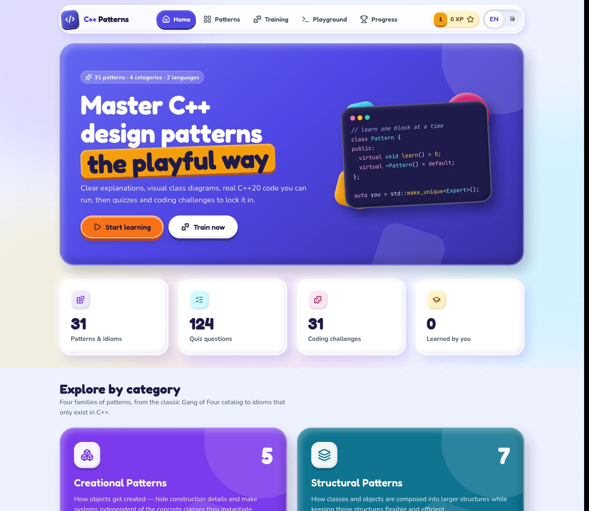
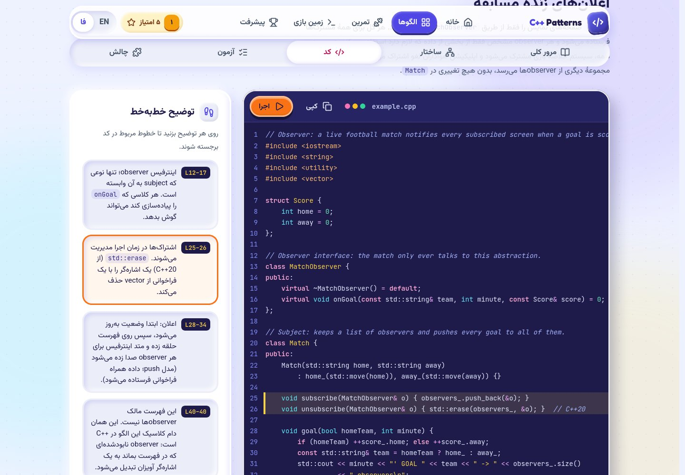
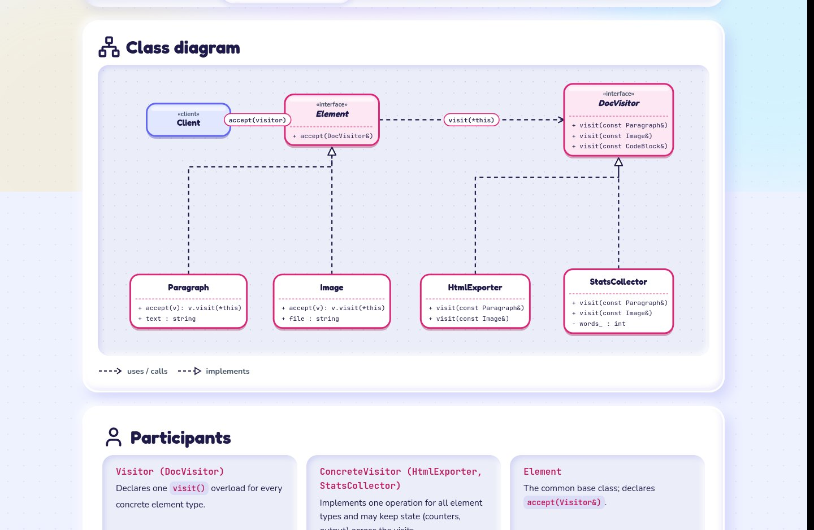

# C++ Patterns Trainer

A bilingual (**English / فارسی**) Node.js web app that teaches every classic C++ design pattern — plus the essential modern C++ idioms — with explanations, UML class diagrams, runnable C++20 examples, quizzes and compiler-checked coding challenges.

Designed with the **UI/UX Pro Max** skill in an *Educational Platform* style: **Claymorphism** surfaces combined with **Vibrant & Block-based** layout.

**▶ Live demo: https://omidrazzaghi2000.github.io/cpp-patterns-trainer/** ([فارسی](https://omidrazzaghi2000.github.io/cpp-patterns-trainer/?lang=fa))

[](https://github.com/omidrazzaghi2000/cpp-patterns-trainer/actions/workflows/pages.yml)



| Lesson (Persian, RTL) | Class diagram |
|---|---|
|  |  |

## What's inside

**31 patterns in 4 categories**

| Category | Patterns |
|---|---|
| Creational | Singleton · Factory Method · Abstract Factory · Builder · Prototype |
| Structural | Adapter · Bridge · Composite · Decorator · Facade · Flyweight · Proxy |
| Behavioral | Chain of Responsibility · Command · Interpreter · Iterator · Mediator · Memento · Observer · State · Strategy · Template Method · Visitor |
| Modern C++ idioms | RAII · Pimpl · CRTP · Type Erasure · Policy-Based Design · Null Object · Object Pool · Copy-and-Swap |

**Every lesson has five tabs**

1. **Overview**: intent, problem, solution, real-world analogy, when to use, pros/cons, modern C++ tips, real-world usage, related patterns (with how they differ).
2. **Structure**: a UML class diagram (rendered as SVG), participants, implementation steps.
3. **Code**: a modern C++20 example with a line-by-line walkthrough. Press **Run** to compile and execute it live.
4. **Quiz**: 4 questions (concept, code, trade-offs, comparison) with explanations.
5. **Challenge**: complete a starter program in the in-browser editor. **Check** compiles it and compares the output exactly, with hints and a reference solution.

**Training arena**
- **Quiz mix**: random questions from the categories you choose, with shuffled options.
- **Pattern match**: read a real-world scenario and pick the pattern.
- **Flashcards**: see the intent, recall the pattern.
- **Code challenges**: all 31 challenges in one list.

**Progress**: XP, 8 levels, 11 badges, a daily streak and per-category progress. Everything is stored in the browser's `localStorage`, with export, import and reset.

**Playground**: write and run any single-file C++20 program, or load any pattern's example.

Totals: 124 quiz questions, 62 real-world scenarios, 93 C++ programs. All programs are verified to compile warning-free with `-Wall -Wextra -pedantic -Werror` and to print exactly the output shown in the lessons.

## Requirements

- **Node.js 18+**
- **g++ with C++20 support** (GCC 10+) for running code. Without it the app still works; only Run, Check and Playground are disabled. To use a different compiler, set `CXX=clang++`.

## Quick start

```bash
npm install
npm start            # → http://127.0.0.1:3000
```

- **Language:** the app picks English or Persian from the browser language. Switch with the **EN / فا** toggle in the header, or open `http://127.0.0.1:3000/?lang=fa`.
- **Offline:** fonts (Fredoka, Nunito, Vazirmatn, JetBrains Mono), icons and the CodeMirror editor are all served from `node_modules`, so after `npm install` no internet connection is needed.

| Script | What it does |
|---|---|
| `npm start` | Start the server (`PORT`, `HOST`, `CXX`, `CXX_STD` env vars are honoured) |
| `npm run dev` | Same, restarting on changes in `server/` or `content/` |
| `npm test` | API + content tests (`node:test`); includes a real compile when g++ is present |
| `npm run validate` | Validate all lesson content: schema, bilingual completeness, and compile/run every example, starter and solution |
| `npm run build:static` | Build a fully static site into `dist/` (what GitHub Pages serves) |
| `npm run preview:static` | Serve `dist/` at `http://127.0.0.1:4000/cpp-patterns-trainer/` |

## Two ways to run

| | Local server (`npm start`) | Static site (`dist/`, GitHub Pages) |
|---|---|---|
| Lesson data | Express JSON API | Pre-rendered JSON files |
| Run / Check / Playground | your local `g++` | [Compiler Explorer](https://godbolt.org) public API (x86-64 GCC 13.4). Learners are told their code is sent there |
| Training rounds | generated by the server | generated in the browser (same logic) |

GitHub Actions (`.github/workflows/pages.yml`) runs on every push to `main`: `npm test`, then `npm run validate` (compiles all 93 programs), then `npm run build:static`, then deploys `dist/` to GitHub Pages. Pull requests run the same checks without deploying.

## Security note

`/api/run` compiles and executes the C++ code it receives, so the server binds to **127.0.0.1** by default. Jobs run in a temp directory with these limits:

- 5 s wall-clock timeout
- 512 MB address-space limit (POSIX)
- 64 KB output limit
- 100 KB source limit
- at most 2 jobs at a time

These limits protect a learner's own machine from runaway programs. They are **not** a sandbox. Do not expose the server to an untrusted network (for example `HOST=0.0.0.0`) without real isolation such as a container or a jail.

## Project structure

```
server/
  index.js        entry point (binds to 127.0.0.1:3000)
  app.js          Express app + JSON API
  content.js      loads and validates content/patterns/*
  runner.js       compile & run C++ with limits, output diffing
  icons.js        builds one SVG sprite from lucide-static
content/
  categories.json
  patterns/<id>/  pattern.json · example.cpp · exercise.cpp · solution.cpp
public/
  index.html, css/app.css (design tokens at the top)
  js/app.js       shell + hash router
  js/i18n.js      every UI string in English and Persian
  js/store.js     progress, XP, levels, badges (localStorage)
  js/views/       home, catalog, pattern, training, progress, playground
  js/components/  diagram (SVG UML), editor (CodeMirror + console), quiz
  js/api.js       server mode ↔ static mode switch
  js/static-backend.js  static mode: Compiler Explorer runner, training generator
scripts/validate-content.js
scripts/build-static.js     builds dist/ for GitHub Pages
test/api.test.js
.github/workflows/pages.yml test + deploy
design-system/cpppatterns-trainer/MASTER.md   generated design system + decisions
CONTENT_SPEC.md   how to write or extend a pattern
```

## API

| Method & path | Returns |
|---|---|
| `GET /api/meta` | categories, counts, compiler info |
| `GET /api/patterns` | pattern summaries |
| `GET /api/patterns/:id` | full lesson, including example code and exercise starter (not the solution) |
| `GET /api/patterns/:id/solution` | reference solution |
| `POST /api/run` `{ code }` | compile + run result |
| `POST /api/patterns/:id/check` `{ code }` | run result + `passed` + first differing line |
| `GET /api/training/quiz?count=&categories=` | shuffled mixed quiz |
| `GET /api/training/match?count=&categories=` | scenario → pattern rounds |

## Adding or editing a pattern

Follow [CONTENT_SPEC.md](CONTENT_SPEC.md), using `content/patterns/singleton/` as the reference. Then run:

```bash
npm run validate -- <pattern-id>
```

The validator requires both languages for every text, exactly 4 quiz questions, and a valid diagram grid. It also checks that `example.cpp` prints `example.output`, that `solution.cpp` prints `exercise.expectedOutput`, and that the untouched starter does **not** already pass.

---

## فارسی

**مربی الگوهای C++** یک برنامهٔ وب دوزبانه (فارسی / انگلیسی) با Node.js است. این برنامه ۲۳ الگوی طراحی کلاسیک «گروه چهار نفره» و ۸ ایدیوم مهم C++ مدرن را آموزش می‌دهد. هر الگو شامل این بخش‌هاست:

- توضیح کامل
- نمودار کلاس
- مثال C++20 که درون مرورگر اجرا می‌شود
- آزمون چهارسؤالی
- چالش کدنویسی که کامپایلر درستی آن را بررسی می‌کند

بخش «میدان تمرین» (آزمون ترکیبی، تطبیق الگو و فلش‌کارت)، سیستم امتیاز و سطح و نشان‌ها، و «زمین بازی» برای اجرای کد آزاد هم در برنامه هست.

راه‌اندازی:

نسخهٔ آنلاین: https://omidrazzaghi2000.github.io/cpp-patterns-trainer/?lang=fa

```bash
npm install
npm start      # http://127.0.0.1:3000/?lang=fa
```

برای اجرای کد، `g++` با پشتیبانی از C++20 لازم است. سرور به‌طور پیش‌فرض فقط روی `127.0.0.1` در دسترس است، چون کدی را که دریافت می‌کند کامپایل و اجرا می‌کند.
